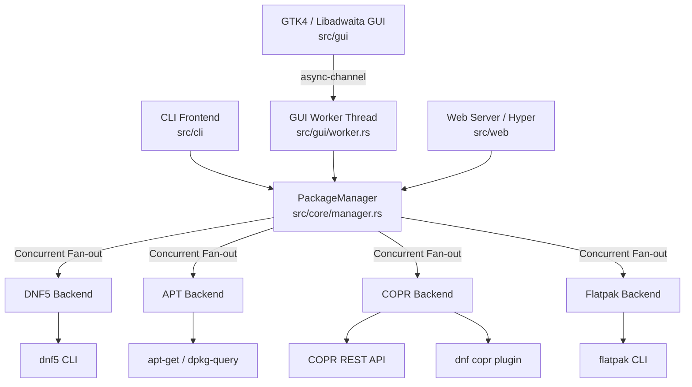

# Brim Architecture & Technical Design

This document details the system design, internal components, concurrency models, and data flow in **Brim**.

---

## 1. High-Level System Architecture

Brim is structured as a layered single-binary application in Rust:



---

## 2. Core Engine (`src/core/`)

### `PackageManager` (`src/core/manager.rs`)
The central orchestrator that coordinates all available package sources:
- **Async Fan-out**: Read queries (search, pending updates, installed lists) are dispatched across all active backends simultaneously using `futures::future::join_all` or streamed channels.
- **Fault Tolerance**: If a single backend encounters a network error or missing system tool, `PackageManager` collects partial results from surviving backends rather than aborting the entire query.
- **Transaction Serialization (`tx_lock`)**: To avoid corrupted states and database lock contention (e.g. DNF/RPM or dpkg lock files), mutating operations (`install`, `remove`, `upgrade`) acquire an asynchronous mutex (`tx_lock`) guaranteeing strictly serialized executions.

### `Backend` Trait (`src/core/backend.rs`)
An asynchronous, object-safe trait implemented by each package manager wrapper:
```rust
#[async_trait]
pub trait Backend: Send + Sync {
    fn name(&self) -> SourceType;
    async fn is_available(&self) -> bool;
    async fn search(&self, query: &str) -> Result<Vec<Package>>;
    async fn list_installed(&self) -> Result<Vec<Package>>;
    async fn info(&self, id: &str) -> Result<Package>;
    async fn install(&self, id: &str) -> Result<TransactionResult>;
    async fn remove(&self, id: &str) -> Result<TransactionResult>;
    async fn check_updates(&self) -> Result<Vec<Package>>;
    async fn upgrade(&self) -> Result<TransactionResult>;
    // Repository management methods...
}
```

---

## 3. Backends Detail (`src/core/backends/`)

1. **DNF5 (`dnf5.rs`)**:
   - Spawns `dnf5` CLI subprocesses with `LC_ALL=C` for deterministic English parsing.
   - Handles the exit code `100` quirk in `check-upgrade` (indicating updates are available).
   - Fast cache-only querying with fallback to network metadata on miss.
2. **APT (`apt.rs`)**:
   - Integrates `apt-cache`, `apt-get`, and `dpkg-query` on Debian/Ubuntu systems.
   - Parses status fields and available candidate versions.
3. **COPR (`copr.rs`)**:
   - Uses the official Fedora COPR REST API for search and package details (bypassing `dnf copr`'s lack of search capability).
   - Leverages `dnf copr enable/disable` for repository registration.
4. **Flatpak (`flatpak.rs`)**:
   - Wraps the `flatpak` CLI for querying remotes, listing installed runtimes and desktop applications.
   - Fetches Appstream icons and resolves Flathub CDN asset URLs.

---

## 4. Frontend Architectures

### A. Terminal CLI (`src/cli/`)
- **Interactive Prompts**: Prompts the user before executing destructive or system-altering commands unless `--yes` is specified.
- **Search Cache (`lastsearch.rs`)**: Persists the last search result sequence to `~/.cache/brim/last-search.json`. Enables index-based shorthand commands such as `brim install 1`.
- **Output Sanitization (`sanitize.rs`)**: Strips terminal escape codes to protect the terminal emulator from malicious payload injections.

### B. GTK4 / Libadwaita Desktop App (`src/gui/`)
- **Threading Separation**: GTK owns the primary OS thread and event loop.
- **Worker Thread (`worker.rs`)**: A separate thread hosts its own multi-threaded Tokio runtime. Communication between the GTK UI and the worker occurs over non-blocking `async-channel` queues (`GuiEvent` and `WorkerEvent`), ensuring the UI stays 100% fluid (60+ FPS) during heavy disk/network I/O.
- **Virtualized Rows**: List views dynamically load and recycle rows for fast scrolling even with thousands of packages.

### C. Web Server & Dashboard (`src/web/`)
- **Hyper 1.x Engine**: Asynchronous HTTP/1 server powered by `hyper` and `hyper-util`.
- **Embedded SPA Assets**: `index.html`, `style.css`, and `app.js` are embedded into the binary at compile time via `include_str!`.
- **Hardened Local API**: Strictly bound to `127.0.0.1`, protected by random session tokens (`x-brim-token`) and strict loopback `Origin` checks.

---

## 5. Storage & Caching Layout

| Path | Purpose | TTL / Lifecycle |
|---|---|---|
| `~/.config/brim/config.json` | Shared user settings & enabled sources | Persistent |
| `~/.cache/brim/trending.json` | Flathub popular/trending catalog | 24 Hours |
| `~/.cache/brim/icons/` | Downloaded Appstream icon cache | Disk Cache |
| `~/.cache/brim/last-search.json` | Index mapping for `brim install <#>` | Overwritten per search |
