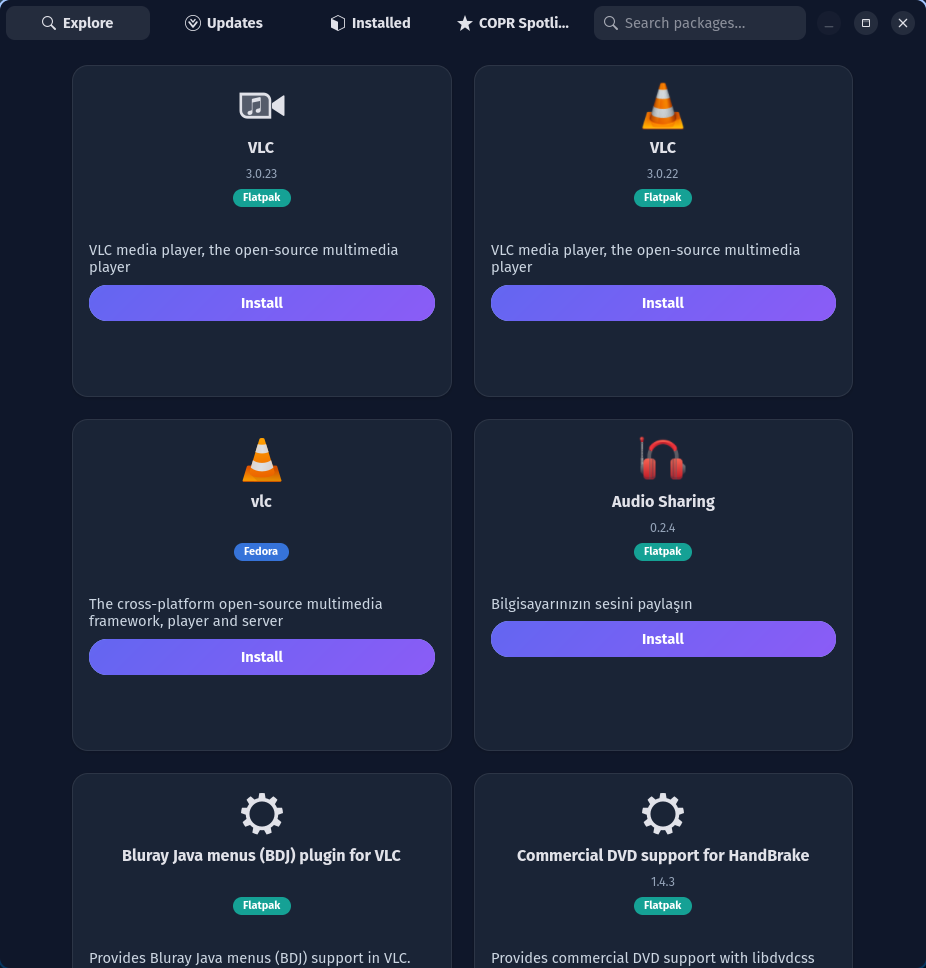
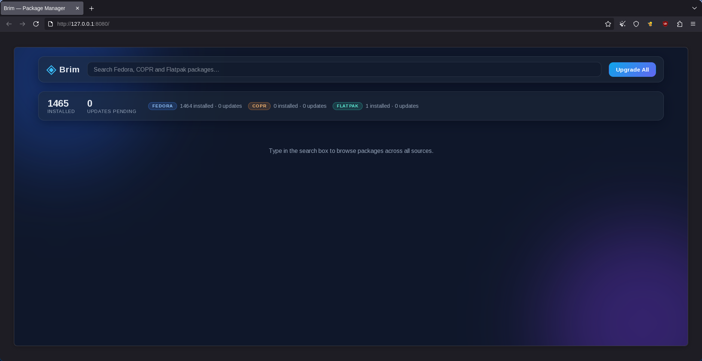

<div align="center">


# Brim

**A modern, pure-Rust package manager and app store for Fedora and Debian.**

[](https://github.com/b4lol/brim/actions/workflows/ci.yml)
[](LICENSE)
[](https://www.rust-lang.org/)
[](https://fedoraproject.org/)

DNF5 packages, APT packages, COPR projects and Flathub apps — one engine,
three frontends, one binary.

`v0.2.0` · Rust edition 2021 · GPL-2.0-only

</div>

---

**Brim** unifies **DNF5** (official Fedora RPMs), **APT** (Debian/Ubuntu
packages), **COPR** (community projects), and **Flatpak** (Flathub) behind a
single async engine, and exposes it through three frontends: a terminal CLI,
a native GTK4/Libadwaita desktop app, and a glassmorphic web dashboard with a
REST API. On any given machine only the available backends activate — on
Fedora that is DNF5 + Flatpak (+ COPR), on Debian/Ubuntu APT + Flatpak.

## Screenshots

<p align="center">
  <br>
  <em>The GTK4 app — real app logos from Flathub and the system icon theme.</em>
</p>

<p align="center">
  <br>
  <em>The web dashboard — per-source statistics and glassmorphic design.</em>
</p>

## Features

- **One search across everything** — merged, relevance-sorted results from
  Fedora repos, COPR, and Flathub in a single query.
- **Trending page** — the desktop app opens on Flathub's popular collection,
  cached on disk for 24 hours (`~/.cache/brim/trending.json`) so repeat visits
  are instant and offline visits fall back to the stale cache.
- **Native GNOME UI** — the desktop app follows the system light/dark style
  (libadwaita), with virtualized list rows (only visible rows are rendered)
  and a detail dialog per package instead of a card grid.
- **Native HTTP** — all web access (COPR API, trending, icon downloads) goes
  through `reqwest` with rustls: pure-Rust TLS, connection reuse, no `curl`
  dependency at runtime.
- **Real app logos** — package cards resolve icons from local Flatpak exports,
  the Flathub CDN (cached in `~/.cache/brim/icons`), and the system icon theme
  for installed RPMs, with a clean category fallback everywhere else.
- **COPR discovery that actually works on dnf5-era Fedora** — search/info use
  the read-only COPR REST API (the `dnf copr` plugin has no `search`); repo
  enable/disable still go through the plugin. COPR installs are best effort:
  the repo is enabled first, then the package is installed by project name —
  if the package step fails, the transaction reports failure but the enabled
  repo is intentionally left in place (and `remove` disables it again).
- **Real transactions** — install, remove, upgrade execute actual system
  changes via `dnf5` / `dnf copr` / `flatpak`; the CLI confirms first
  (`--yes` to skip).
- **Repository management** — the desktop app's Settings page lists, adds and
  removes flatpak remotes (with `--user` retry and a `--show-disabled` view)
  and lists/enables/disables COPR repos.
- **Sync export/import** — back up the installed package set as a versioned
  JSON file from the Settings page, and reinstall from it on a fresh
  system.
- **Updates at a glance** — `dnf5 check-update` and
  `flatpak remote-ls --updates` merged into one pending-updates view, plus
  per-source dashboard statistics.
- **Three frontends, one engine** — a single `brim` binary hosts the CLI,
  the GUI (`brim gui`) and the web UI (`brim web`) over one shared core
  engine; missing tools degrade gracefully instead of failing.
- **Shared configuration** — one `~/.config/brim/config.json` for the CLI, the
  GUI and future services; edit it from the Settings page or with
  `brim config set`.

## Requirements

- Fedora Linux (developed and verified on Fedora 44) with `dnf5`, `dnf` (COPR
  plugin), and `flatpak` available — or Debian/Ubuntu with `apt` and
  `flatpak`. Missing tools are skipped, never fatal.
- Rust stable toolchain via [rustup](https://rustup.rs/) (with the `rustfmt`
  and `clippy` components for development)
- For the GUI: system GTK4 and Libadwaita development packages:

  ```bash
  sudo dnf5 install gtk4-devel libadwaita-devel    # Fedora
  sudo apt install libgtk-4-dev libadwaita-1-dev   # Debian/Ubuntu
  ```

## Quickstart

```bash
git clone https://github.com/b4lol/brim
cd brim
just install
```

`just install` (requires [just](https://github.com/casey/just)) installs a
single `brim` binary twice: into `~/.cargo/bin` for your user and into
`/usr/local/bin` system-wide. The system-wide copy matters because
system-package transactions run with `sudo`, and root's `secure_path` does
not cover `~/.cargo/bin` — without it `sudo brim ...` fails with "command
not found". Re-run `just install` after every upgrade so the root copy
never goes stale.

Without `just`, the two manual steps are equivalent:

```bash
cargo install --path . --locked
sudo install -m 0755 ~/.cargo/bin/brim /usr/local/bin/brim
```

The binary serves all three frontends: the terminal CLI by default, the
desktop app via `brim gui`, and the web server via `brim web`. Other `just`
recipes: `just check` (full CI suite), `just completions` (bash/zsh),
`just uninstall`. Run `just` to list them all.

## CLI Usage

The terminal companion (binary name: `brim`):

| Command | Description |
| ------- | ----------- |
| `brim search <query> [--source <name>]` | Search all sources, or just one |
| `brim install <id\|#> [--source <name>] [--yes]` | Install by id or result number (confirms unless `--yes`) |
| `brim remove <id> [--source <name>] [--yes]` | Remove (confirms unless `--yes`) |
| `brim upgrade [--yes]` | Upgrade everything across all sources |
| `brim list` | List installed packages (with per-source counts) |
| `brim updates` | Pending updates in detail: installed → new version, grouped by source |
| `brim stats` | Per-source dashboard statistics |
| `brim info <id> [--source <name>]` | Package details |
| `brim config list\|get\|set\|reset` | View and edit configuration |
| `brim completions <bash\|zsh>` | Print a shell completion script |
| `brim gui` | Launch the graphical app store |
| `brim web [--port 8080]` | Run the web UI and REST API |

`<name>` is `fedora`, `debian`, `copr`, or `flatpak`. The confirmation prompt names the
resolved source before any transaction runs (e.g.
`Confirm install 'htop' from Fedora? [y/N]`). System-package transactions
(dnf5 and the COPR plugin) require root — as a regular user Brim fails fast
with an actionable message (`dnf5 transactions require root — re-run with
sudo …`) instead of surfacing the tool's raw refusal; flatpak transactions
work unprivileged.

Search results stream in numbered rows as each source answers, and the
displayed order is cached (`~/.cache/brim/last-search.json`), so a number
installs exactly the row you saw:

```bash
brim search ghostty     # 1  ghostty  …  2  …
brim install 1          # installs row 1 from the last search
```

Examples:

```bash
brim search ghostty
brim search editor --source flatpak
brim install htop               # asks [y/N] first
brim install htop.x86_64 --yes  # non-interactive
brim info @ghostty/ghostty      # COPR project details via the COPR API
brim upgrade                    # upgrades dnf5 packages and flatpaks
```

Output is colorized and tabular; transactions show spinners and exit non-zero
on failure. Pipelines behave (`brim list | head` exits quietly — SIGPIPE is
handled properly).

Shell completions for bash and zsh are generated from the CLI definition:

```bash
# bash (auto-loaded by bash-completion)
brim completions bash > ~/.local/share/bash-completion/completions/brim

# zsh — add the directory to fpath in ~/.zshrc first:
#   fpath=(~/.local/share/zsh/site-functions $fpath)
#   autoload -Uz compinit && compinit
brim completions zsh > ~/.local/share/zsh/site-functions/_brim
```

## Desktop App

```bash
brim gui
```

A native GNOME-style store with four pages — **Trending**, **Updates**,
**Installed**, **Settings** — debounced live search, and toast notifications.
The app follows the system light/dark style. The Trending page shows
Flathub's popular collection
(24 h disk cache). The Settings page holds the source switches, **Export**/
**Import** of the installed set as JSON, and flatpak remote / COPR repo
management. Packages render as list rows in a
virtualized `ListView` (only the visible rows exist as widgets, so thousands
of results scroll smoothly); clicking a row opens a detail dialog with the
full description and actions. All package operations run on a background
worker that executes requests concurrently, so searches stay responsive even
during long transactions; icon downloads are batched and rate-limited so they
never starve core events; destructive actions (Remove, Upgrade All) ask for
confirmation first; closing the window shuts the worker down cleanly. The
header bar's app menu opens an About dialog with version, license and
project links.

## Web Dashboard

```bash
brim web --port 8080   # 8080 is the default
# then open http://127.0.0.1:8080
```

The server binds **127.0.0.1 only** and serves both the embedded SPA and the
REST API:

| Endpoint | Description |
| -------- | ----------- |
| `GET /api/packages` | Merged search results as a JSON array of `Package`. Query parameters: `q` (search text; `[]` when omitted), `source` (optional: `fedora`, `copr`, or `flatpak`) |
| `GET /api/stats` | `SystemStats` dashboard statistics |
| `POST /api/install` | Body `{"id": "htop", "source": "fedora"}` (`source` may be `null`) → `TransactionResult` |
| `POST /api/remove` | Same body shape → `TransactionResult` |
| `POST /api/upgrade` | Upgrade across all backends → `TransactionResult` |

> [!WARNING]
> The `POST` endpoints perform **real** system transactions. They are guarded
> by an exact-host `Origin` check — cross-origin requests from other websites
> are rejected with `403` — and request bodies are capped at 64 KiB. Never
> widen the bind address: the localhost binding is the security boundary.

## Development

```bash
cargo fmt --all -- --check
cargo clippy --all-targets -- -D warnings
cargo test --all-targets
cargo build --release
```

The same four commands run in CI on every push and pull request (see
[`.github/workflows/ci.yml`](.github/workflows/ci.yml)).

The test suite is hermetic — parsers are pure functions over captured fixtures
and no test spawns a real system command, so tests run anywhere, not just on
Fedora.

## Contributing

Contributions welcome. Please:

1. Keep changes minimal and focused; match the existing code style.
2. Keep parsers pure and add fixtures captured from real tool output.
3. Run the full verification suite above before submitting — all four
   commands must pass.
4. Update docs when you change behavior (commands, endpoints, models).

## License

GNU General Public License v2.0 — see the [LICENSE](LICENSE) file.
